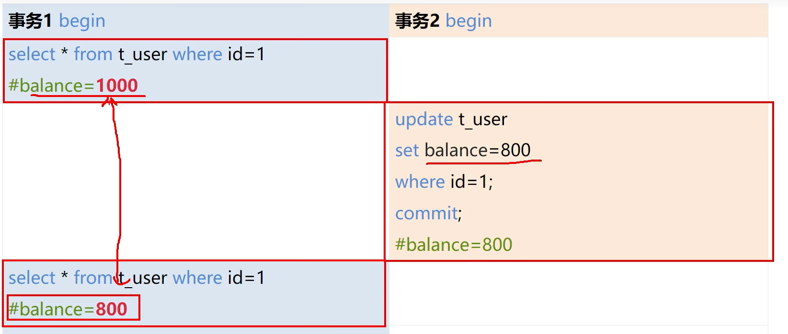
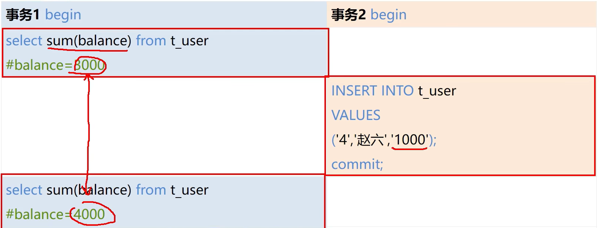
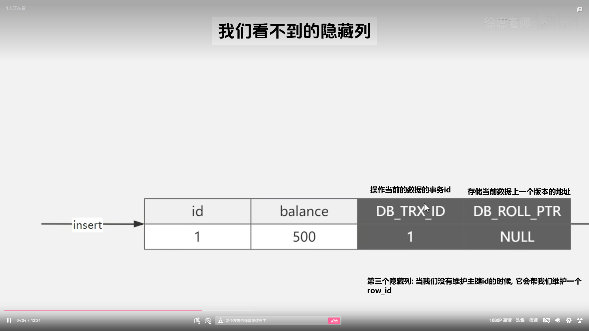
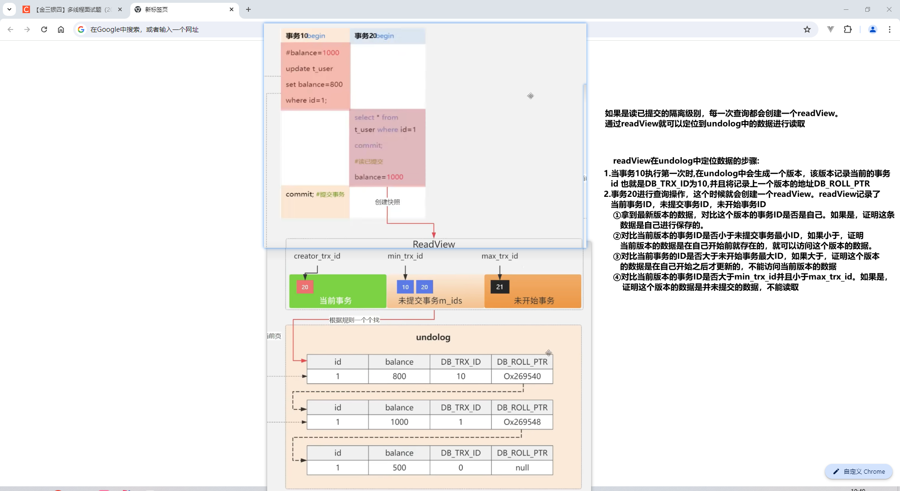

# 事务隔离级别的实现原理是什么

## 并发情况下出现的问题

### 脏读

### 不可重复读

### 幻读(整张表)

Mysql的默认隔离级别是可重复读,Oracle的默认隔离级别是读已提交

## 解决问题

MVCC: 乐观锁的一种实现

### MVCC的关键点1: 隐藏列

### MVCC关键点2: readView

### MVCC关键点3: undolog

### 各种问题MVCC解决方式

# Mysql如何实现索引?

Mysql中索引有三种: B+树索引、hash索引、全文索引(对全文的数据做摘要和索引)

在innoDB和MyISAM存储引擎中，主要是B+树索引，hash索引配合B+树索引做辅助索引

# InnoDB索引和MyISAM索引实现的区别是什么?

①InnoDB索引在存储时和数据是在一个文件中的

​	MyISAM存储索引是单独的文件，和数据并不在一个文件中。

②在B+树的叶子节点中存数指向具体数据的: InnoDB(聚簇索引: 指向数据本身，非聚簇索引:指向数据的ID进行回表操作) MyISAM是物理地址

# 一个表中如果没有创建索引，那么还会创建B+树吗?

会。表中存在主键: 创建主键聚簇索引   不存在主键: 会自动维护一个row_id ，创建聚簇索引

# 什么是Mysql索引?有什么优缺点?

索引是一种能够去帮助Mysql高效的去从磁盘中去检索数据的一种数据结构。在Mysql的InnoDB引擎里，采用的是B+树的结构来实现索引和数据存储。

## 优点:

①通过B+树的结构来存储数据，可以大大减少数据检索时的磁盘IO次数，从而提升数据查询的性能。

②B+树索引在进行范围查找的时候，只需要找到起始节点，然后基于叶子节点的链表结构往下读取即可。查询效率较高。

## 缺点

①数据在进行写操作时，需要涉及到索引的维护，当数据量较大的时候，索引的维护会带来较大的性能开销

②一个表中允许存在一个聚簇索引和多个非聚簇索引，但是索引数不能创建太多，否则造成的索引维护成本过高

③创建索引的时候，需要考虑到索引字段值的分散性，如果字段的重复数据过多，创建索引反而会带来性能消耗

# Mysql为什么使用B+树作为索引结构

①常规的数据库存储引擎，一般都是采用B树或者B+树来实现索引的存储。因为B树是一种多路平衡树，存储大量数据时，整体高度相比二叉树来说会矮很多。而对于数据库来说，所有的数据必然是存储在磁盘上的。而磁盘的IO效率实际上是很低的，特别是在随机磁盘IO的情况下，效率更低。所以树的高度就能够决定磁盘IO的一个次数。磁盘IO次数越少，那么对性能的提升就会越大。这就是采用B树作为索引存储的结构的原因。但是在Mysql的InnoDB存储引擎中，采用的是一种增强的B树结构，也就是B+树。来作为索引和数据的一个存储结构。相比于B树的结构B+树做了几个方面的优化:

​					一、B+树的所有数据都存储在叶子节点上，而非叶子节点只会存储索引

​					二、叶子节点里的数据是使用双向链表的方式进行关联的所以使用B+树作为索引的存储结构，有以下优点:

​							a. B+树的非叶子节点不存储数据，所以每一层能够存储的索引数量会增加，意味着B+树在层高相同的情况下存储的数据量要比B树更多，使得磁								盘IO次数更少

​							b. 在Mysql中，范围查询是一个比较常用的操作，而B+树的所有存储在叶子节点的数据使用了双向链表来关联，所以在查询的时候只需查两个节								点进行遍历就行，而B树需要获取所有节点。所以B+树在范围内查询效率上较高。

​							c. 在数据检索方面，由于所有的数据都存储在叶子节点上，所以B+树的IO次数会更稳定一些

​							

# MyISAM和InnoDB的区别

​	存储引擎的作用: 

​			①定义数据存储的方式

​			②数据读取的实现逻辑

在Mysql5.5之前，默认的存储引擎是MyISAM。在5.5以后，InnoDB就作为了默认的存储引擎。在实际应用开发中，我们基本上是使用InnoDB。

MyISAM引擎: 

​	数据通过二进制的方式存储在磁盘上，它的磁盘体现为两个文件:一个是数据文件.MYD文件，另一个是索引文件.MYI文件

InnoDB存储引擎:

​	数据同样存储在磁盘上，它的磁盘上只有一个ibd的文件，里面包含索引和数据。在B+树的叶子节点里面，存储了索引对应的数据。在通过索引进行检索的时候，命中叶子节点，就可以直接从叶子节点里面读取数据即可

区别有四个:

​	①数据存储方式不同，MyISAM里面的索引和数据是分开存储的，而InnoDB是把索引和数据存储在同一个文件里面

​	②对于事务的支持不同，MyISAM不支持事务。而InnoDB支持ACID的一个事务处理

​	③对于锁的支持不同，MyISAM只支持表锁，而InnoDB可以根据不同的情况去支持行锁、表锁、间隙锁、临键锁

​	④MyISAM不支持外键，InnoDB支持外键

根据不同的常见选择不同的存储引擎:

​	需要支持事务: InnoDB

​	大部分表操作是查询: MyISAM