# Java基础

### new String('abc')到底创建了几个对象?

首先，这个代码里面由一个'new'关键字，这个关键字在程序运行的时候，根据已经加载的系统类String，在堆内存里去实例化一个字符串对象，然后在这个String的构造方法里面，传递了一个"abc"的一个字符串。因为String里的字符串成员变量，是一个final修饰的，所以它是一个字符串常量。所以接下来JVM会去拿字面量"abc"，去字符串常量池里面试图去找对应它的一个String的对象引用。如果拿不到，就会在堆内存里面去创建一个"abc"的String对象，并且把引用保存到字符串常量池里面。后续如果再有字面量"abc"的一个定义,因为字符串常量池里面已经存在字面量"abc"的一个引用,所以只需要从常量池里面获取对应的引用就可以了，不需要再去创建。所以对于这个问题，答案有两个

1. 如果"abc"这个字符串常量不存在，那么我需要去创建两个对象。分别是"abc"这个字符串常量，以及new String这个实例对象(有的版本说三个，是加上了栈中这个对象的引用)
2. 如果"abc"这个字符串常量存在，那么只会创建一个对象，就是String这个对象(有的版本说两个，是加上了栈中这个对象的引用)


拓展**String str1 = new String("A"+"B") ; 会创建多少个对象?**

str1：

字符串常量池："A","B","AB" : 3个

堆：new String("AB") ：1个

引用： str1 ：1个

总共 ： 5个


个人理解加上栈的引用应该是3个,因为new String("A"+"B")再编译后就是new String("AB")

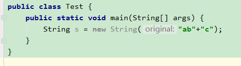

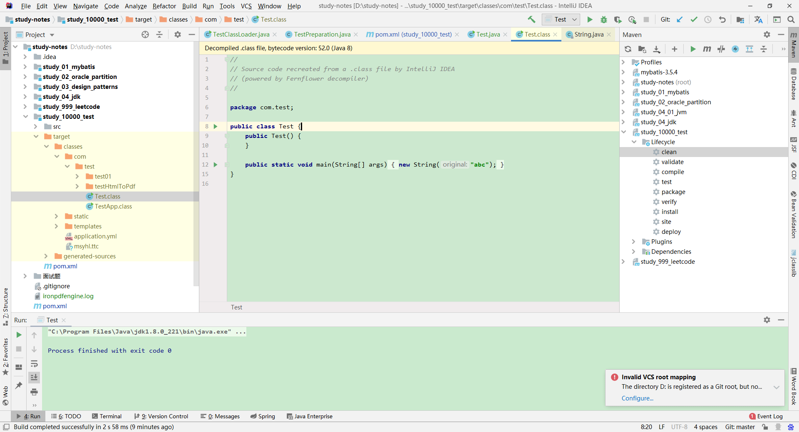

### Java中有哪几种方式来创建线程执行任务?

①继承Thread类

弊端: Java中的类是单继承的，重写的是run(),而不是start()

②实现Runnable接口

```java
public class Test1Thread implements Runnable{
    public static void main(String[] args) {
        Thread thread = new Thread(new Test1Thread());
        thread.start();
    }


    @Override
    public void run() {
        System.out.println("启动了一个线程");
    }
}
```

弊端: 无法在线程中返回值

③实现Callable接口

```java
public class Test2Thread implements Callable {


    public static void main(String[] args) throws ExecutionException, InterruptedException {
        FutureTask<String> task = new FutureTask<String>(new Test2Thread());
        Thread thread = new Thread(task);
        thread.start();

        String result = task.get();
        System.out.println(result);
    }

    @Override
    public Object call() throws Exception {
        return "hello";
    }
}
```

④使用线程池

### JVM面试核心点与性能优化点

#### JVM组成部分

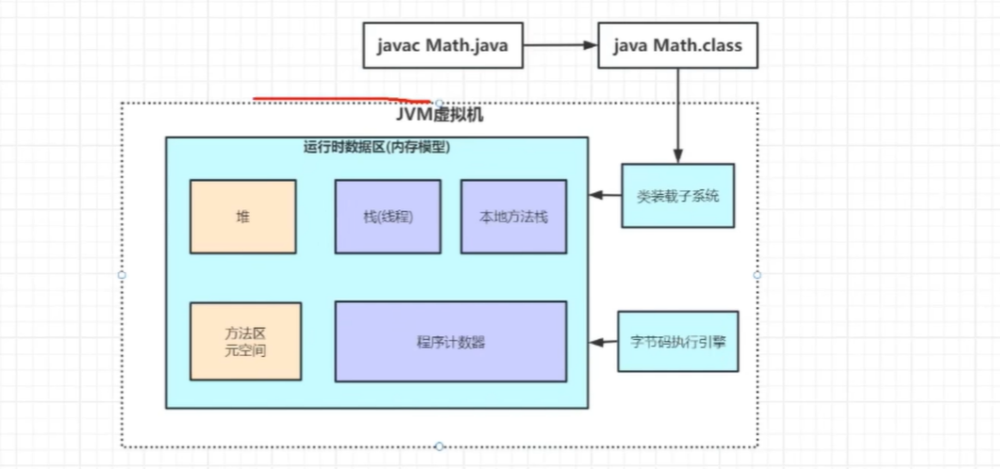

#### 虚拟机栈

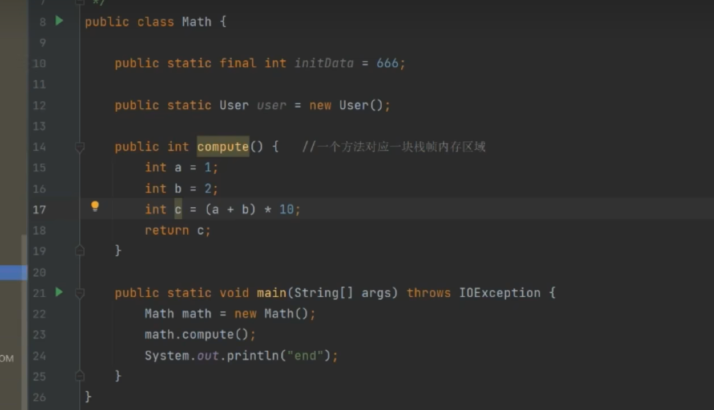

使用javap -c 进行反汇编

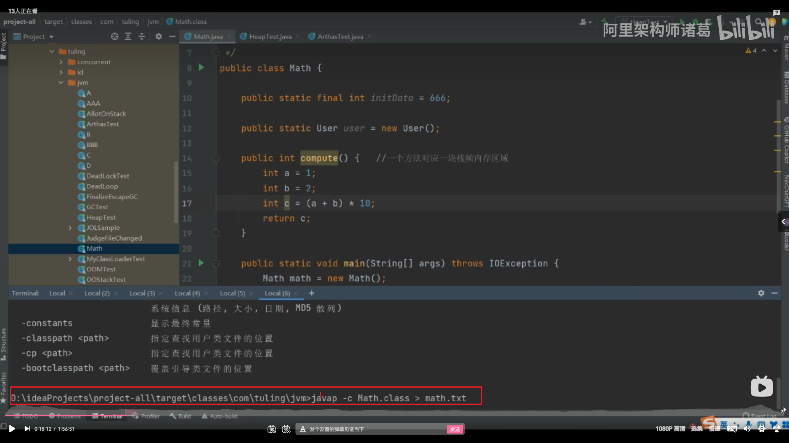

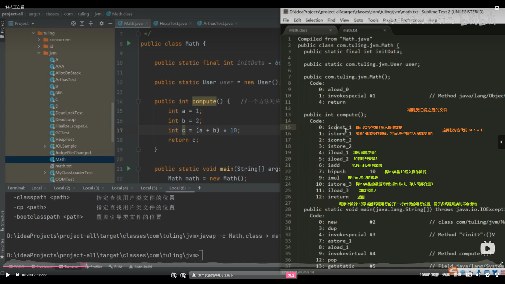

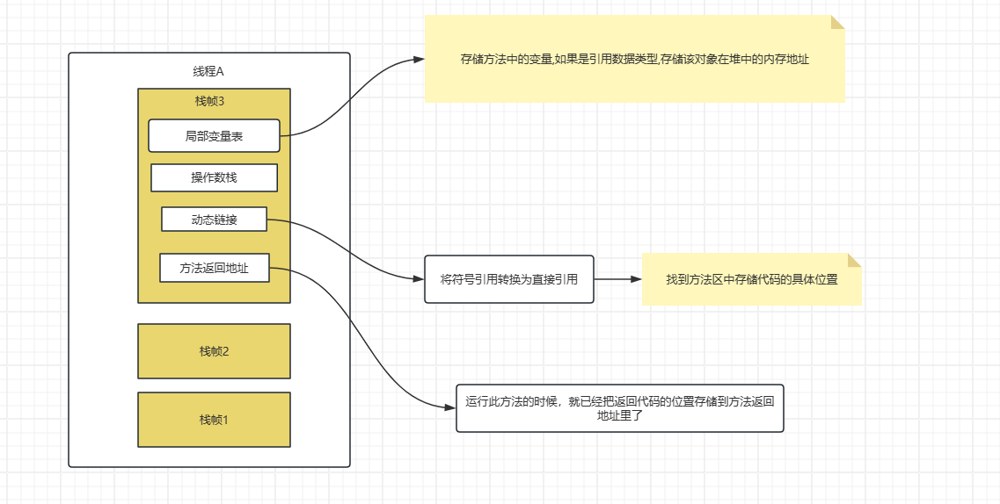

#### 方法区

常量+静态变量+类信息

#### 堆

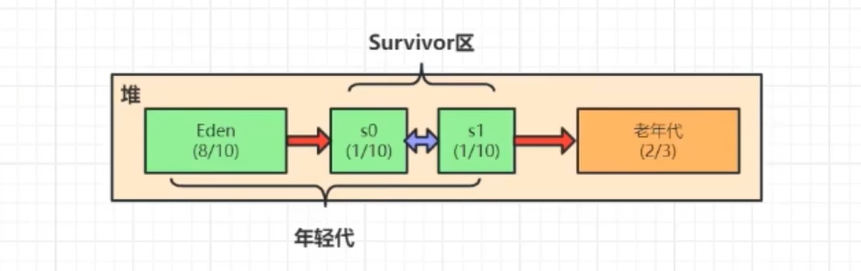

年轻代:老年代  1:3

年轻代中  伊甸园区:幸存者一区:幸存者二区 = 8:1:1

每次new对象时，都存放在Eden区。当Eden区满了的时候，触发minor gc(或者young gc)

垃圾回收线程由字节码执行引擎发起，通过可达性分析算法区别伊甸园区和幸存者区中的一个区的垃圾对象和非垃圾对象，将非垃圾对象复制到另一个幸存者区,将此对象的分代年龄设置为1 ，将伊甸园区的垃圾对象清除。每当幸存者区的对象经过gc后幸存，就会将分代年龄+1。一般情况，当分代年龄达到15时，该对象将被放入老年代。当老年代中的内存被占满时，会发生full GC。当老年代占满时,会发生OOM

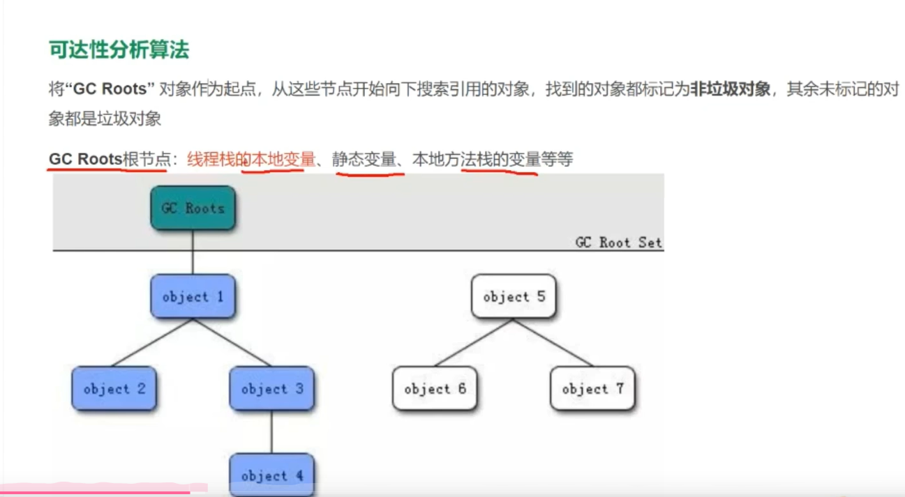

JVM调优测试

 

```java
/**
 * Created with IntelliJ IDEA.
 *
 * @Author: 翟佳佳
 * @Date: 2024/05/18/15:37
 * @Description:
 */
public class OOMTest {
    public static void main(String[] args) throws InterruptedException {
        List<Test> tests = new ArrayList<>();   //该对象放在局部变量表中,作为GC roots根节点之一,引用了下面循环中的对象
        while (true){
            tests.add(new Test());
        }
    }
}
```

#### 使用arthas排查线上问题

1. 官网下载:  https://alibaba.github.io/arthas

2. 在服务器运行arthas-boot.jar

   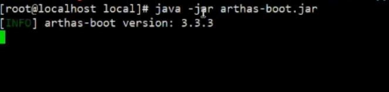

3. 运行后arthas会找出当前机器的所有JVM进程

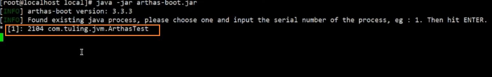

4. 选择需要诊断的进程,输入该进程前面的序号。等待logo出来之后,就可以使用arthas

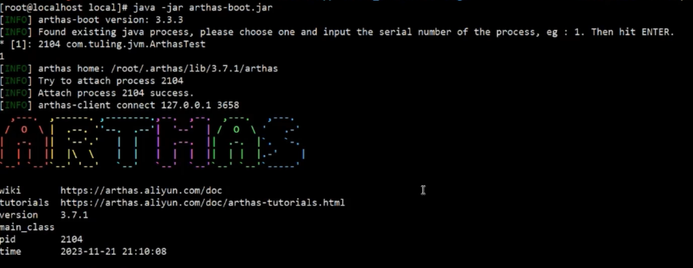

5. 输入dashboard

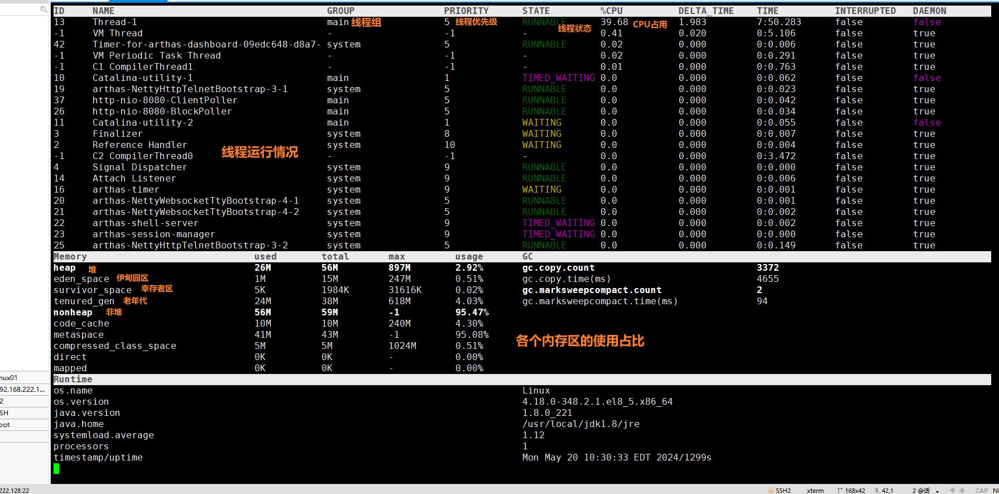
